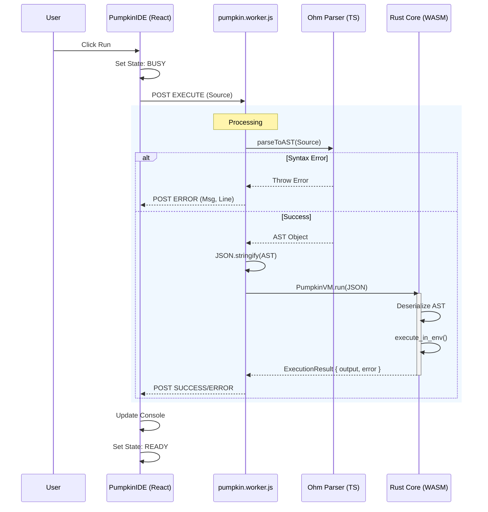

# Pumpkin Execution Lifecycle (Browser)

> **Status:** Authoritative
> **Context:** In-Browser IDE Execution
> **Components:** CodeMirror, Web Worker, Ohm Parser, Rust WASM Core

## 1. Overview

This document defines the complete lifecycle of a Pumpkin program when executed within the browser-based IDE. The architecture utilizes a **Hybrid Execution Model**:

1. **Parsing (Frontend/TS):** Ohm-js converts source code to an AST.
2. **Execution (Backend/WASM):** Rust Core receives the AST and executes it.

---

## 2. Lifecycle Stages

### Stage 1: Code Input

* **Actor:** User / CodeEditor Component
* **State:** `Idle` -> `InputReceived`
* **Action:** User types code into the `CodeMirror` instance in `PumpkinIDE.tsx`.
* **Trigger:** User clicks the **"RUN CODE"** button (`handleRun`).
* **Data:** Raw Source String (e.g., `let x = 10`).

### Stage 2: Worker Dispatch

* **Actor:** PumpkinIDE (Main Thread) -> Web Worker
* **State:** `InputReceived` -> `WorkerProcessing`
* **Action:** The main thread posts an `EXECUTE` message to `pumpkin.worker.js`.
* **Failure Potential:** Worker initialization failure or message clone error.
* **Observability:** "BUSY" indicator and Spinner appear in UI.

### Stage 3: Syntax Validation & Parsing

* **Actor:** Web Worker (TypeScript)
* **State:** `WorkerProcessing` -> `Parsed`
* **Tool:** `ohm-js` (via `src/parser.ts`)
* **Action:**
    1. Worker receives raw source.
    2. Calls `parseToAST(source)`.
    3. Ohm grammar matches text against rules.
* **Failure Handling:**
  * If parsing fails, Ohm throws a syntax error.
  * **Transition:** Lifecycle aborts -> `Error` state.
  * **Output:** Friendly syntax error message returned to UI.

### Stage 4: AST Transformation & Serialization

* **Actor:** Web Worker (TypeScript)
* **State:** `Parsed` -> `Serialized`
* **Action:**
    1. The `CST` (Concrete Syntax Tree) from Ohm is transformed into a `Pumpkin AST` (JSON-serializable).
    2. AST is serialized to a JSON string: `JSON.stringify(programAST)`.
* **Reasoning:** Passing complex JS objects to WASM is expensive/complex. JSON is a robust bridge.

### Stage 5: Execution (Rust WASM)

* **Actor:** Rust Core (`pumpkin_core`) via WASM
* **State:** `Serialized` -> `Executed`
* **Action:**
    1. Worker calls `PumpkinVM.run(ast_json)`.
    2. **Deserialization:** Rust (`serde_json`) converts JSON back to Rust `Program` struct.
    3. **Interpretation:** `execute_in_env` traverses the Rust AST.
    4. **Side Effects:** `show` statements append to an internal output vector.
* **Failure Handling:**
  * Runtime Errors (e.g., Infinity/0) return an `ExecutionResult` with `success: false`.

### Stage 6: Output Capture

* **Actor:** Rust Core -> Web Worker
* **State:** `Executed` -> `ResultReturned`
* **Action:**
    1. Execution finishes.
    2. Returns `ExecutionResult` struct (contains `output: Vec<String>` and optional `error`).
    3. Rust serializes `ExecutionResult` to JS Object.

### Stage 7: Response & Rendering

* **Actor:** Web Worker -> PumpkinIDE -> Console
* **State:** `ResultReturned` -> `Idle`
* **Action:**
    1. Worker posts `SUCCESS` or `ERROR` message back to Main Thread.
    2. `handleRun` in `PumpkinIDE` receives payload.
    3. `setOutput` updates the Console component.
    4. `setIsRunning(false)` unlocks the UI.

---

## 3. Data Flow Diagram

