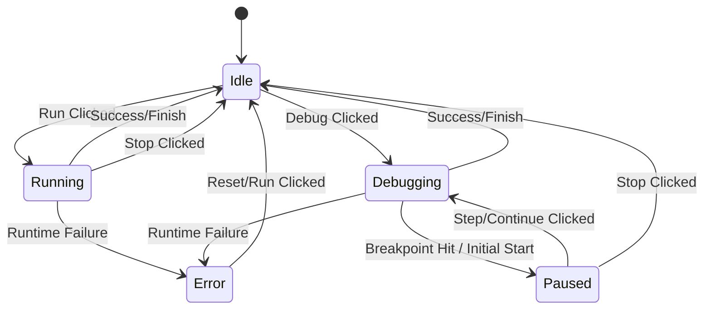

# Execution State Model

> **Status:** Authoritative
> **Context:** PumpkinIDE (Frontend)
> **Pattern:** Finite State Machine (FSM)

## 1. Overview

To prevent invalid UI states (e.g., clicking "Run" while "Paused", or "Step" while "Idle"), the IDE transitions from simple `useState` boolean flags to a strict **Finite State Machine**.

**Benefits:**

1. **Safety:** Impossible to reach invalid states.
2. **Clarity:** UI renders strictly based on current state.
3. **Debuggability:** Easy to trace "why did the runner crash?".

---

## 2. State Definitions

The execution lifecycle consists of 5 mutually exclusive states:

| State | Description | Active Controls |
| :--- | :--- | :--- |
| **IDLE** | Editor is unlocked. Ready to run. | `Run`, `Debug`, `Reset` |
| **RUNNING** | Fast execution (no stepping). Editor locked. | `Stop` |
| **DEBUGGING** | Worker is alive but waiting for commands. | `Step`, `Continue`, `Stop` |
| **PAUSED** | (Sub-State of Debug) Stopped at a breakpoint/line. | `Step`, `Continue`, `Stop` |
| **ERROR** | Execution failed (Runtime/System/Syntax). | `Reset`, `Run` (Retry) |

*Note: `COMPLETED` is treated as a transition back to `IDLE` with a "Success" flag, rather than a lingering state.*

---

## 3. The State Machine



---

## 4. Reducer Logic (Implementation Spec)

We will use `useReducer` to manage this complex state.

### 4.1. State Interface

```typescript
type ExecutionStatus = 'IDLE' | 'RUNNING' | 'DEBUGGING' | 'PAUSED' | 'ERROR';

interface IDEState {
    status: ExecutionStatus;
    
    // Data (Only relevant in certain states)
    code: string;
    output: string[];
    currentLine?: number;        // For Debugging/Error highlight
    variables: Record<string, string>; // Debugging snapshot
    errorMessage?: {             // Error Details
        title: string;
        desc: string;
    };
}
```

### 4.2. Actions

```typescript
type Action = 
    | { type: 'EDIT_CODE', payload: string }
    | { type: 'START_RUN' }
    | { type: 'START_DEBUG' }
    | { type: 'EXECUTION_STEP', payload: { line: number, vars: any } } // Worker pauses
    | { type: 'RESUME_EXECUTION' }                                     // User clicks step
    | { type: 'APPEND_OUTPUT', payload: string }
    | { type: 'FINISH_SUCCESS' }
    | { type: 'FINISH_ERROR', payload: { title: string, desc: string, line?: number } }
    | { type: 'STOP_MANUAL' }
    | { type: 'RESET' };
```

### 4.3. Transitions (Reducer)

* **START_RUN:**
  * From: `IDLE`
  * To: `RUNNING`
  * Effect: Clears output, error. Locks editor. Spawns Worker.

* **START_DEBUG:**
  * From: `IDLE`
  * To: `DEBUGGING`
  * Effect: Clears output. Locks editor. Spawns Worker with `debug: true`.

* **EXECUTION_STEP (Worker Message):**
  * From: `DEBUGGING`
  * To: `PAUSED`
  * Data: Updates `currentLine` and `variables`.
  * Effect: Highlights line in Editor.

* **RESUME_EXECUTION (User Action):**
  * From: `PAUSED`
  * To: `DEBUGGING`
  * Effect: Unlocks worker (via Atomics or postMessage).

* **FINISH_ERROR:**
  * From: `RUNNING` | `DEBUGGING`
  * To: `ERROR`
  * Data: Sets `errorMessage`.

* **FINISH_SUCCESS:**
  * From: `RUNNING` | `DEBUGGING`
  * To: `IDLE`
  * Effect: Editor unlocks.

---

## 5. UI Reactions

| Component | Reaction to State |
| :--- | :--- |
| **Run Button** | Disabled if not `IDLE` or `ERROR`. |
| **Debug Button** | Disabled if not `IDLE`. |
| **Step Button** | Visible only in `PAUSED`. |
| **Stop Button** | Visible in `RUNNING`, `DEBUGGING`, `PAUSED`. |
| **Editor** | ReadOnly in `RUNNING`, `DEBUGGING`, `PAUSED`. |
| **Gutter** | Shows "▶" arrow at `currentLine` if `PAUSED`. Shows "🔴" if `ERROR`. |
| **Variable Panel** | Shows `variables` map if `PAUSED` or `DEBUGGING`. |

This model ensures a predictable, robust user experience where the UI always accurately reflects the engine's internal state.
