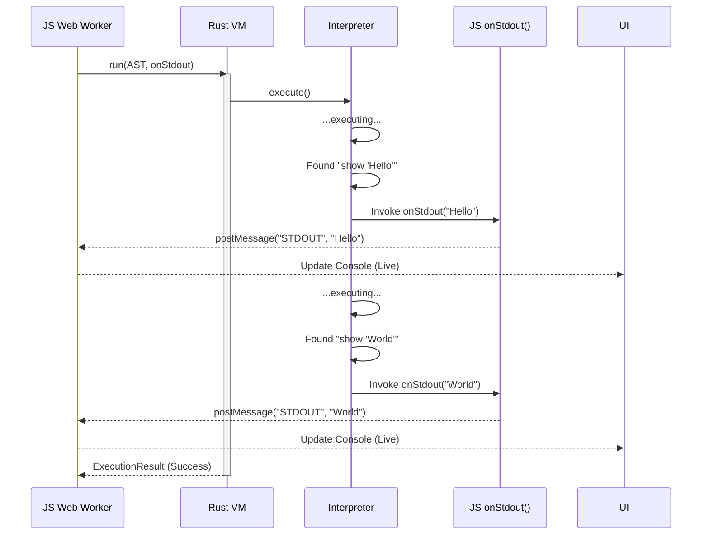

# Output Capture System Design

> **Status:** Draft
> **Goal:** Live, streaming output for Pumpkin programs.
> **Constraint:** Browser Main Thread must remain responsive; output must appear immediately as code executes.

## 1. The Problem: Buffering vs. Streaming

The current v0.1 architecture returns `output: Vec<String>` inside the `ExecutionResult` **after** the entire program finishes.

* **Issue:** If a user runs a slow loop (`repeat 10 { show "hi"; sleep(1) }`), they see nothing for 10 seconds, then everything at once. This feels broken.
* **Requirement:** "Output must feel live."

## 2. Proposed Architecture: Callback-Based Streaming

To achieve live output, we must invert the flow. Instead of *returning* output, the Rust VM will *emit* output events via a JavaScript callback provided during execution.

### 2.1. Updated Execution Flow

1. **JS Side (Worker):** Define an `onStdout(line)` callback.
2. **Boundary:** Pass this callback to the WASM `run` function.
3. **Rust Side:**
    * The `Interpreter` gets a reference to the JS callback.
    * When executing a `ShowStmt`, instead of pushing to a Vector, it invokes the callback.
    * **Crucial:** This requires `wasm-bindgen` support for `js_sys::Function`.

### 2.2. Data Flow Diagram



## 3. Output Event Model

The console should handle different streams of data.

### 3.1. Event Types

| Type | Payload | Source | Visual Style |
| :--- | :--- | :--- | :--- |
| `STDOUT` | `string` | `show` statement | Standard white text |
| `STDERR` | `string` | Runtime errors | Red text / background |
| `SYSTEM` | `string` | VM status (e.g., "Running...") | Dimmed italic text |
| `DEBUG` | `string` | AST dumps (if enabled) | Blue monospaced |

### 3.2. Worker Message Protocol (Update)

The `pumpkin.worker.js` message protocol needs to expand to support streaming updates, not just a final success/error.

```typescript
// Incoming to Main Thread
type WorkerMessage = 
  | { type: 'STREAM_STDOUT', payload: string }
  | { type: 'EXECUTION_COMPLETE', payload: ExecutionResult };
```

## 4. Console Rendering Rules

### 4.1. React Implementation (`Console.tsx`)

* **State:** `lines: ConsoleLine[]`
* **Update Strategy:**
  * Append new lines as `STREAM_STDOUT` messages arrive.
  * **Auto-scroll:** The console container should automatically scroll to the bottom when new content arrives.
* **Format:**
  * Each line is a separate `<div>` or list item.
  * Preserve whitespace (`pre-wrap`).
  * Monospace font (`Fira Code` or similar).

### 4.2. Performance Guardrails (Rate Limiting)

* **Risk:** `loop { show "spam" }` can crash the React renderer if it emits 1000 messages/sec.
* **Solution:** **Throttled Batching**.
  * The Main Thread `PumpkinIDE` component maintains a generic specific buffer.
  * React State updates happen at most every **16ms (60fps)** or **50ms**.
  * Accumulated lines are pushed in one `setState` call.

## 5. API Changes Required

### JS Layer

```typescript
// Proposed signature update
run(astJson: string, onOutput: (line: string) => void): ExecutionResult
```

### Rust Layer

```rust
// pumpkin_core/src/wasm.rs
#[wasm_bindgen]
pub fn run(&self, ast_json: &str, on_output: &js_sys::Function) -> JsValue {
   // ...
   // Inside interpreter loop:
   // on_output.call1(&JsValue::NULL, &JsValue::from_str(&message));
   // ...
}
```

## 6. Failure Modes

| Mode | Behavior |
| :--- | :--- |
| **Output during Crash** | Streaming ensures the user sees output *leading up to* the crash. This is vital for debugging. |
| **Output during Timeout** | If the sandbox kills the worker, the UI retains all streamed output received *before* the timeout. |
