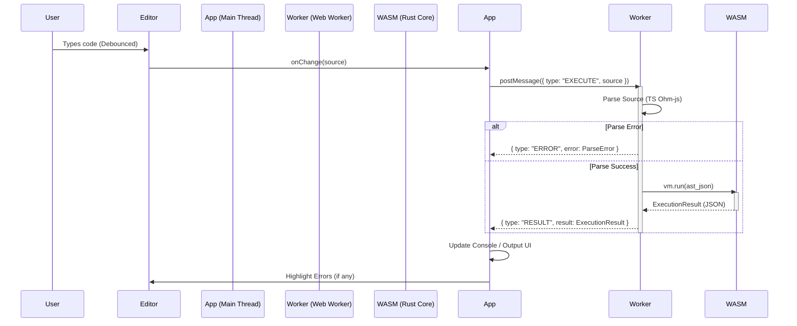

# Web Playground Execution Flow 🎢

**Goal:** Execute Pumpkin code in the browser without freezing the UI.
**Components:** Javascript Editor (Monaco/CodeMirror), TypeScript Parser, Rust Core (WASM), React UI.

## 1. High-Level Pipeline



## 2. State Transitions

The Playground UI manages the following states:

1. **Idle:** No code changes, waiting for input.
2. **Parsing/Executing:** Code changed, waiting for Worker response.
    * *UI:* Show "Running..." indicator (spinner or status text).
3. **Success:** Execution completed successfully.
    * *UI:* valid output displayed in Console.
    * *UI:* "Ready" status.
4. **Error:** Parse or Runtime error occurred.
    * *UI:* Error message in Console (Red).
    * *UI:* Red squiggle in Editor at `error.location`.

## 3. Worker Implementation Strategy

To ensure the "Never Freeze" rule, execution logic must live in a Web Worker.

### `playground.worker.ts`

```typescript
import init, { PumpkinVM } from './pkg/pumpkin_core';
import { parseToAST } from './parser';

let vm: PumpkinVM | null = null;

self.onmessage = async (e) => {
    if (e.data.type === 'INIT') {
        await init();
        vm = new PumpkinVM();
        self.postMessage({ type: 'READY' });
    } else if (e.data.type === 'EXECUTE') {
        if (!vm) return; 
        
        try {
            const ast = parseToAST(e.data.source);
            const result = vm.run(JSON.stringify(ast));
            self.postMessage({ type: 'RESULT', result });
        } catch (err) {
            // Handle Parse Errors
            self.postMessage({ type: 'ERROR', error: formatParseError(err) });
        }
    }
};
```

## 4. UI/UX Considerations

* **Deboucing:** Do not execute on every keystroke. Wait for 500ms-1s of silence or an explicit "Run" button click.
* **Console Output:** The `output` field from Rust is an array of strings. This should be rendered as a list of `<div>`s in a styled Console component.
* **Error Highlighting:** Use the `SourceLocation` {line, col} from `PumpkinError` to set decorations in the code editor.

## 5. Security

* **Sandboxing:** WASM is sandboxed.
* **Loops:** Use a "gas limit" or generic timeout in the Worker loop (if possible in future) to prevent infinite loops from locking the Worker (though the Worker locking doesn't freeze the UI, it does stop providing results). For v0.1, we rely on the user refreshing if they write `while true {}`.
