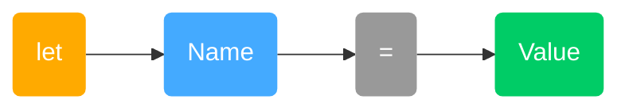
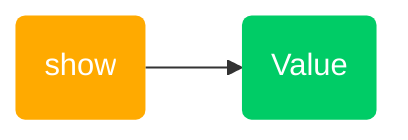
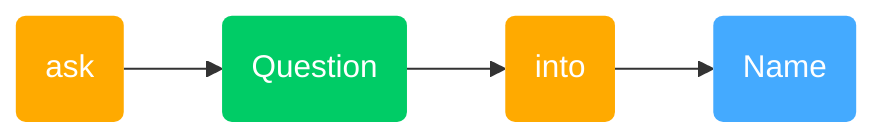
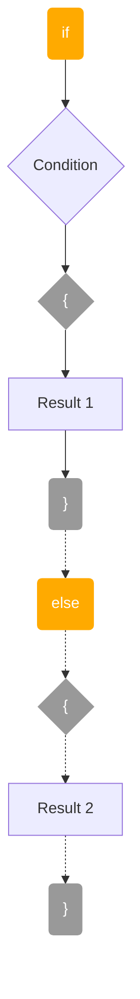
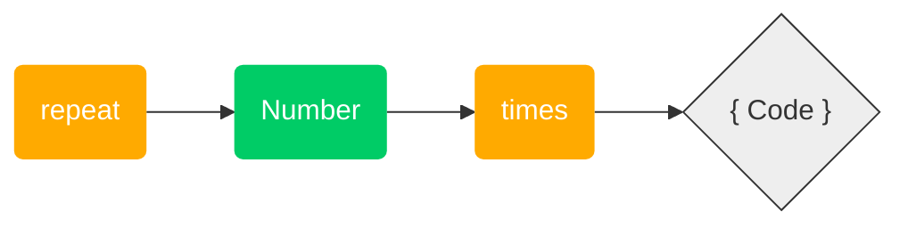
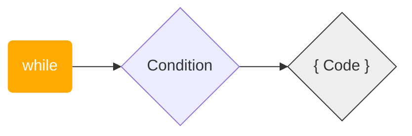
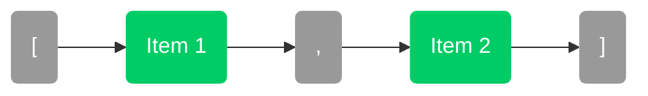
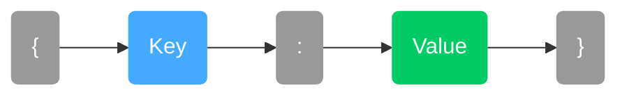
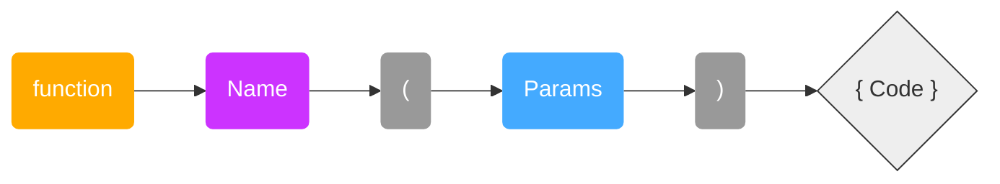
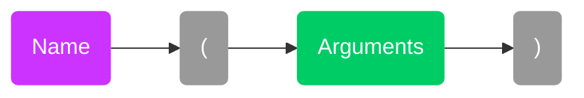

# 🎨 Pumpkin Visual Syntax Guide

This guide helps you see the "shape" of Pumpkin code. Use these diagrams to remember how to write commands.

---

## 1. Basics

### Variable Declaration

**What it does**: Creates a box to store information.



* **Pattern**: `let` `name` `=` `value`
* **Example**: `let score = 100`

### Print Statement

**What it does**: Shows text or numbers on the screen.



* **Pattern**: `show` `value`
* **Example**: `show "Hello!"`

### Input Statement

**What it does**: Asks the user a question.



* **Pattern**: `ask` `"Question?"` `into` `variable`
* **Example**: `ask "Name?" into user`

---

## 2. Logic & Loops

### If / Else Block

**What it does**: Makes a decision.



* **Pattern**: `if` `condition` `{` `result` `}`
* **Example**:

    ```pumpkin
    if score > 10 {
        show "Win!"
    }
    ```

### Repeat Loop

**What it does**: Does the same thing a specific number of times.



* **Pattern**: `repeat` `number` `times` `{` `code` `}`
* **Example**:

    ```pumpkin
    repeat 3 times {
        show "Hip hip hooray!"
    }
    ```

### While Loop

**What it does**: Repeats *while* a condition is true.



* **Pattern**: `while` `condition` `{` `code` `}`
* **Example**:

    ```pumpkin
    while x < 10 {
        x = x + 1
    }
    ```

---

## 3. Data & Functions

### List

**What it does**: A collection of items.



* **Pattern**: `[` `Item`, `Item` `]`
* **Example**: `["Apple", "Banana"]`

### Object

**What it does**: A group of labeled items.



* **Pattern**: `{` `key` `:` `value` `}`
* **Example**: `{ name: "Pumpkin", ver: 1 }`

### Function Definition

**What it does**: Creates a new command.



* **Pattern**: `function` `name` `(` `params` `)` `{` `code` `}`
* **Example**:

    ```pumpkin
    function greet(name) {
        show "Hi " + name
    }
    ```

### Function Call

**What it does**: Runs the command.



* **Pattern**: `name` `(` `values` `)`
* **Example**: `greet("Alice")`
